# Particle-based Thunderstorm Tracking with Integral-based Shape Vector Descriptors for Robust Nowcasting

### Authors

<div style="text-align: center;">
T. Q. Hieu<sup>[2,3]</sup>,  
T. Q. Trung<sup>[2,3,<span style="font-family: FontAwesome;">&#xf0e0;</span>]</sup>,  
T. V. Hoai<sup>[1,2,3]</sup>,  
N. A. Khoa<sup>[2,3]</sup>,  
P. T. An<sup>[1,3,<span style="font-family: FontAwesome;">&#xf0e0;</span>]</sup>
</div>

---

<sup>1</sup> Institute of Mathematical and Computational Sciences and Faculty of Applied Science, Ho Chi Minh City University of Technology, 268 Ly Thuong Kiet, Dien Hong Ward, Ho Chi Minh City, Vietnam  
<sup>2</sup> Faculty of Computer Science and Engineering, Ho Chi Minh City University of Technology, 268 Ly Thuong Kiet, Dien Hong Ward, Ho Chi Minh City, Vietnam  
<sup>3</sup> Vietnam National University Ho Chi Minh City, Linh Xuan Ward, Ho Chi Minh City, Vietnam  
<sup><span style="font-family: FontAwesome;">&#xf0e0;</span></sup> Corresponding authors:
Email addresses: trung.tranquoc2004@hcmut.edu.vn (T. Q. Trung), thanhan@hcmut.edu.vn (P. T. An)

---

### Abstract

Thunderstorm Identification, Tracking, and Nowcasting (TITAN) is a widely used framework for convective nowcasting. Conceptually, storms are first identified from reflectivity fields in the identification stage before being associated across consecutive scans in the tracking stage. During this process, the historical evolution of each storm is estimated, which serves as the basis for forecasting future storm parameters in the nowcasting stage. Nevertheless, frequent splitting and merging events distort storm history chains, posing a significant challenge within the tracking stage. 

To address this, we propose a novel tracking scheme inspired by particle filtering, representing each storm as a set of particles to effectively handle complex matching scenarios. Crucially, to robustly match these particles between time scans, we introduce a novel integral-based **Shape Vector descriptor**. To ensure viability for real-time nowcasting, this descriptor is efficiently constructed utilizing the frequency-domain convolutions. Experiments reveal that our approach outperforms competing methods in terms of contingency table-based metrics, including the probability of detection (POD), false alarm ratio (FAR), and critical success index (CSI).


### Dependencies and Data Processing
The radar data analyzed in this research is retrieved from the Next Generation Weather Radar (NEXRAD) system (Level-II Base Data).
* **Preprocessing Toolkit:** The raw radar data is processed using The Python ARM Radar Toolkit (Py-ART). This library reads the NEXRAD archive files, maps the raw polar coordinate data to a uniform three-dimensional Cartesian grid, and generates the final 2D composite reflectivity fields by extracting the maximum reflectivity value throughout the vertical column.

### Methodology Pipeline
Our framework builds upon the traditional Thunderstorm Identification, Tracking, and Nowcasting (TITAN) pipeline utilizing a novel particle-based approach:

1. **Identification Stage:**
   - **Storm Detection:** Extracts contiguous storm cells from the reflectivity map using a morphology-based identification method to effectively separate falsely merged cells and storm clusters.
   - **Particle Sampling:** Uniformly samples a set of particles within each isolated storm boundary, with the number of particles directly proportional to the storm's pixel area.
   - **Shape Vector Construction:** Encodes the local spatial context and geometry around each particle.

2. **Tracking Stage:**
   - **Particle Matching:** Formulates matching between consecutive frames at the particle level using the Hungarian algorithm.
   - **Coarse Motion Vector Estimation:** Infers an initial displacement vector for each matched storm pair by aggregating the displacements of the corresponding matched particles.
   - **Fine Motion Vector Estimation:** Refines the coarse prediction using a localized Tracking Radar Echo by Correlation (TREC-based) cross-correlation search.
   - **History Updating:** Records matched storms, handles new or expired storms, and assigns identifiers to track their evolution.

3. **Nowcasting Stage:**
   - Extrapolates historical tracking data to forecast future storm positions by utilizing linear interpolation with a weighted decay.

### Evaluation
The proposed particle matching scheme is evaluated on selected NEXRAD storm cases against state-of-the-art  tracking algorithms, including TITAN, ETITAN, STITAN, ISCIT, and ATA.
* **Nowcasting Metrics:** Probability of Detection (POD), False Alarm Ratio (FAR), and Critical Success Index (CSI).
* **Tracking Metrics:** Object consistency, mean duration, trajectory linearity (RMSE), and optimal tracking scores compared against a post-event reanalysis.

### How to run program

#### Download packages
To make sure the code runs with a compatible version of packages, you need to download the required dependencies from the `requirements.txt` file using the command:
```bash
pip install -r requirements.txt`
```

#### Running evaluation pipeline

To run the full evaluation pipeline from the project root, install dependencies and then run the main script. Example:

```bash
python main.py --dataset KARX --model ours --max-velocity 100 --identification-method morphology
```

Command-line arguments

- `--dataset` (str, default: `KARX`): the dataset folder under `data/numpy_grid/` containing the .npy radar frames to evaluate. Example values: `KARX`, `KDVN`, `KGRR` (use the folder name present in `data/numpy_grid/`).

- `--model` (str, default: `ours`): the nowcasting/tracking model to run. Examples include the repository's implementations such as `ours` (PTT-ISVD), and benchmark algorithms referenced in this work (e.g. `stitan`, `etitan`, `iscit`, `ata`, `titan`) — use the exact model key supported by `utils.evaluation_models.create_model`.

- `--max-velocity` (int, default: `100`): maximum allowed velocity (in km/h) used by the motion estimation and association routines. Increase or decrease this to control how far objects are allowed to move between frames.

- `--identification-method` (str, default: `morphology`): object identification strategy used to detect storms in each frame. Supported options in the codebase: `simple`, `morphology`, `hypothesis`, `cluster`. Their detailed descriptions can be found in the paper.

#### Experiments with Interactive Notebooks
We also provide Jupyter Notebooks for step-by-step execution, evaluating models against benchmark algorithms (using POD, FAR, and CSI metrics):

* `experimental_notebooks/` directory: For experimental analysis and isolated testing of specific modules like image preprocessing or storm identification.
* `model_evaluation.ipynb`: To execute the evaluation pipeline and generate quantitative scores.

### Example Visualizations

<table>
  <tr>
    <td align="center" width="50%"><b>STITAN (2008)</b><br>
      
    </td>
    <td align="center" width="50%"><b>ETITAN (2009)</b><br>
      
    </td>
  </tr>
  <tr>
    <td align="center" width="50%"><b>ISCIT (2010)</b><br>
      
    </td>
    <td align="center" width="50%"><b>ATA (2021)</b><br>
      
    </td>
  </tr>
  <tr>
    <td align="center" colspan="2"><b>PTT-ISVD (our)</b><br>
      
    </td>
  </tr>
</table>
