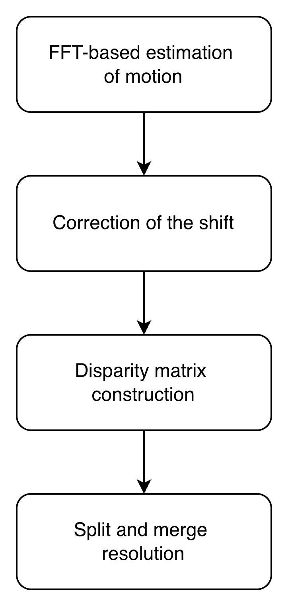

# ATA (2021)

---
### **Model Workflow**
1. **FFT-based estimation of motion**: For each storm in the first scan, the motion is estimated as follows:
    -  (1) Define a square flow region centered on the storm, with side length equal to the storm's maximum extent plus a buffer corresponding to the maximum allowable displacement. 
    - (2) Apply FFT-based phase correlation to estimate the displacement vector 
    - (3) Clip the resulting velocity if its magnitude exceeds the prescribed maximum displacement.
2. **Correction of the shift**: Compute the corrected shift by averaging the estimated shift and the historical motion of the previous frame. If these two vectors differ by more than the predefined magnitude, the later term is used as the corrected shift.
3. **The cost function of disparity matrix**: For each target storm in the first scan, construct a search region based on its corrected displacement. Storms in the subsequent scan that lie partially or entirely within this region are treated as candidates. For each target-candidate pair, the matching cost is defined using four terms: 
    - (1) The distance between their centroids. 
    - (2) The distance between the candidate centroid and the predicted target location. 
    - (3) The area difference. 
    - (4) The overlap area. 
    - Finally, Hungarian algorithm is employed to find the optimal storm associations.
4. **Split and merge resolution**: Employ the same overlapping technique as described in TITAN.

### Experimental Notebook
[View Experimental Notebook](../../../experimental_notebooks/ata_model.ipynb)