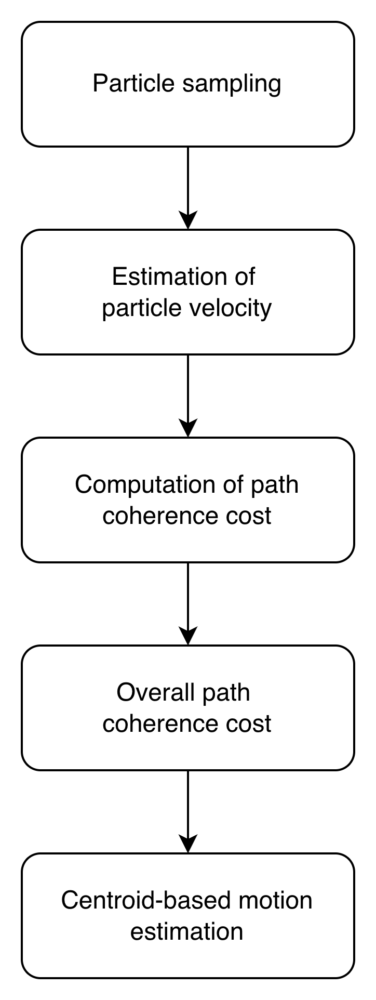

# ISCIT (2010)

---
### **Model Workflow**
1. **Particle sampling**: For each storm, uniformly sample a set of particles following the similar procedure described in STITAN.
2. **Estimation of particle velocity**: At each time step, assign a velocity estimate to each existing storm cell, obtained either from user-specified input (for the first scan) or from the recorded motion history. Then, each particle carries the same velocity estimation as its storm. In our reimplementation, the initial matching is performed using motion fields derived from the TREC-based scheme employed in EITAN and STITAN, rather than relying on user-specified velocities. For subsequent matches, the velocity is estimated by combining the historical motion using the linear interpolation scheme.
3. **Computation of path coherence cost**: Construct a particle-level disparity matrix, or the path coherence cost, in which the cost of assigning particles $p_{1}$ and $p_{2}$ from the first and second frames is defined by two penalty terms: the change in movement direction $d_{D}$ and the change in speed $d_{S}$. Specifically:
$$
d_D = 1 - \frac{v_e \cdot v_d}{\|v_e\| \|v_d\|}
$$

$$
d_S =
\begin{cases}
1 - \dfrac{2\sqrt{\Delta_{\max}\left(\Delta_{\max} - \lVert v_e - v_d \rVert\right)}}{2\Delta_{\max} - \lVert v_e - v_d \rVert}, & \lVert v_e - v_d \rVert \le \Delta_{\max} \\[10pt]
1, & \lVert v_e - v_d \rVert > \Delta_{\max}
\end{cases}
$$

where $v_{e}$ denotes the estimated velocity and $v_{d}$ denotes the velocity derived from particle displacement, while $\Delta_{max}$ denotes the maximum change in speed. For any entry that has either $d_{D}>1$ or $d_{S}=1$, its value is set to infinity, eliminating the possibility of assignment.
4. **Overall path coherence cost**: Once the path coherence cost has been created, Hungarian algorithm is employed to find the optimal particle assignments. Following that, two probability matrices $P_{A}$ $P_{B}$ for matching storms are computed as: 

\[P_{A}=\frac{NP}{max(A_{1},A_{2})}; P_{B}=\frac{NP}{max(A_{1},A_{2})}\]

where NP is the number of particles that were matched between storms from the first and second maps; whereas $A_{1}$, $A_{2}$ are their number of particles, respectively. A soft Hungarian matching procedure is applied to each matrix to obtain the initial assignments.Specifically, the algorithm proceeds as follows: 
- (1) Subtract the minimum value of each row from all entries in that row.
- (2) Subtract the minimum value of each column from all entries in that column. 
- (3) Extract assignments corresponding to the zero-valued entries in the resulting matrix. To enlarge the candidate assignment set, the same procedure is repeated with Steps (1) and (2) applied in reverse order (column reduction followed by row reduction). The union of all derived assignments is then decomposed into connected components of the induced bipartite graph, referred to as subsets, such that storms within the same subset are connected through a chain of assignments. 
- Finally, the particle-level matching scheme previously applied to the full storm set is executed independently within each subset. An assignment is considered valid only if $max(P_{A},P_{B})>0.5;$ otherwise, it is discarded.
5. **Centroid-based motion estimation**: For each subset that is maintained, the velocity of all storms in that subset are estimated as the displacement of weighted centroids from the first and second scan.

### Experimental Notebook
[View Experimental Notebook](../../../experimental_notebooks/iscit_model.ipynb)