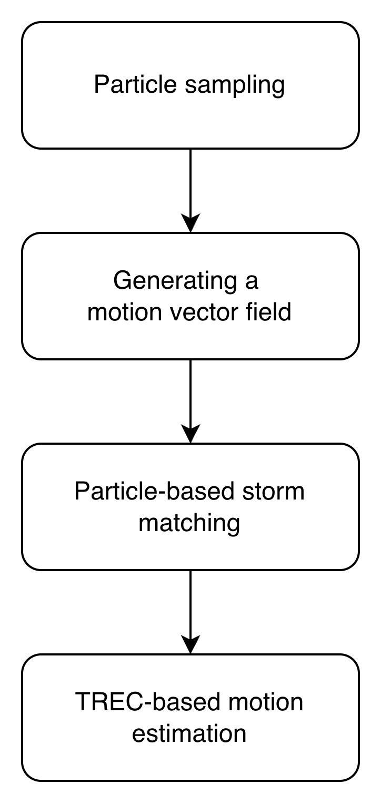

# STitan (2008)

---
### **Model Workflow**
1. **Particle sampling**: A list of particles are uniformly sampled inside each storm cell boundary. In our experimental, we set the density to 0.05 where there are $0.05*A$ particles for storm with the area A (unit: pixels).
2. **Generating a motion vector field**: Generate $V_{TREC}$ with the same idea as described in ETITAN.
3. **Particle-level storm matching**: For each particle, forecast its position using the nearest $V_{TREC}$. For every pair of storm in the previous and later map, define its association probability as:
 \[f=max(\frac{NP}{A_{1}},\frac{NP}{A_{2}})\] 
 where NP is the number of predicted particles of the first storm that fall within second storm; $A_{1}$, $A_{2}$ are the numbers of particles in the first and second storms, respectively. If $f>0.5$, these storms are considered matched.
4. **TREC-based motion estimation**: For each storm in the first map, determine its motion by taking $V_{TREC}$ at the storm centroid.

### Experimental Notebook
[View Experimental Notebook](../../../experimental_notebooks/stitan_model.ipynb)