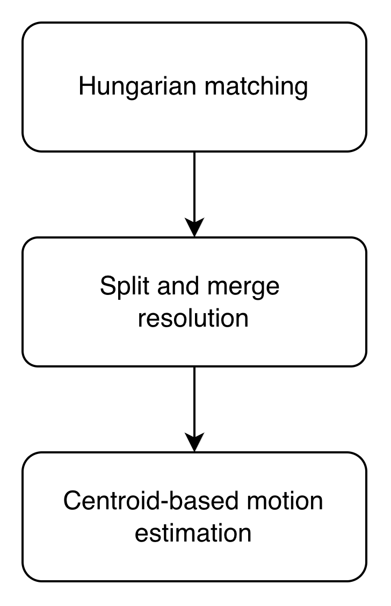

# TITAN (1993)

---
### **Model Workflow**

* **1. Hungarian Matching**: The disparity matrix is constructed based on two factors: the volume difference and the centroid distance. If the centroid distance exceeds the maximum allowable displacement, the corresponding entry is set to infinity to prevent invalid associations. In our experimental, since the input dataset is the composite field which is a 2D, rather than a 3D grid, we substitute the volume difference by the area difference.
* **2. Split & Merge Resolution**: For storms remaining unmatched after Step 1, split and merge cases are evaluated as follows: 
    -  (1) Generate a prediction map from the previous scan. 
    -  (2) For each unmatched storm (from either scan), check whether its centroid lies within the boundary of any storm in the other scan. 
    - (3) If so, assign it as a part of the corresponding container storm.
* **3. Centroid-based Motion Estimation**: For each matched storm pair, the motion vector is computed as the displacement from the centroid of the storm in the previous scan to that in the subsequent scan.

### Experimental Notebook
[View Experimental Notebook](../../../experimental_notebooks/titan_model.ipynb)
